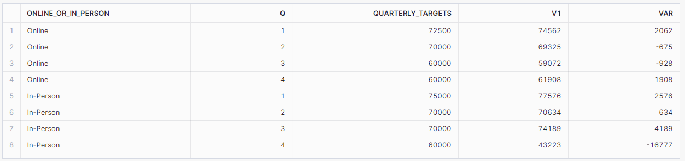

# Preppn-Challenge-2023-Week-3

Solving Tableau Prep Challenge 2023 Week 3 using SQL/Snowflake

**TASK**

2023 Week 3 - Data Source Bank has some quarterly targets for the value of transactions that are being performed in-person and online. It's our job to compare the transactions to these target figures.

- The Transaction Table.

  i. Filter to just look at DSB Transactions.

  ii. Rename the values in the Online or In-person field, Online of the 1 values and In-Person for the 2 values

  iii. Change the date to be the quarter and sum the transaction values for each quarter and for each Type of Transaction

- The Transaction Table.

  i. Pivot the quaterly targets.

  ii. Remove the 'Q' from the quarter field and make the data type numeric

- Join the two datasets (on more than one join clause) and calculate the Variance to Target.

**SQL/Snowflake Techniques Used**

1.  Common Table Expressions and multi-key Joins
2.  Aggregation and column type conversion
3.  Queries with constraints
4.  Filtering and sorting

## Solution

### 1. Prepping the Transaction Table

There are multiple ways to filter the transaction values, in the below case, I have used CONTAIN() function to restrict to transactions that contained DSB in the Transaction_Code column. Case statement replaces the values in the Online or In-person column and Date_part gives the corresponding quarter for the transaction date. For aggregation, I have grouped on Online or In-Person and Quarter (Q) column as asked in the task.

```
            SELECT  SUM (Value) as V1,
                    CASE
                            WHEN online_or_in_person = 2
                                THEN 'In-Person'
                            WHEN online_or_in_person = 1
                                THEN 'Online'
                                    END as online_or_in_person,
                    DATE_PART ('quarter', DATE(LEFT(TRANSACTION_DATE, 10), 'dd/MM/yyyy')) as Q
                        FROM PD2023_WK01
                            WHERE CONTAINS(TRANSACTION_CODE, 'DSB')
                                GROUP BY 2,3
                                ORDER BY  online_or_in_person, Q
                        ;
```

### 2. Prepping the Target Table

While in the challenge it says to Pivot the table, in here I had to use UNPIVOT function to achieve the desired format. It is similar to the **'Transpose' tool in Alteryx.**

```
            SELECT t.ONLINE_OR_IN_PERSON, REPLACE(Month, 'Q', '')::int as Q, Quarterly_Targets, trans.V1,
                    Trans.V1 - Quarterly_Targets as Var
                        FROM PD2023_WK03_TARGETS as t
                            UNPIVOT (Quarterly_Targets FOR month IN (Q1, Q2, Q3, Q4))
                        ;
```

### 3. Joining the tables

I have used Common Table Expressions (CTE) to temporarily store the results of Transaction table query and called it "Trans". It will make joining the two tables easier. I can simply join Trans on Target table query on Online or In-person and Quarter columns

```
    WITH Trans AS(
                    SELECT  SUM (Value) as V1,
                            CASE
                                WHEN online_or_in_person = 2
                                        THEN 'In-Person'
                                WHEN online_or_in_person = 1
                                        THEN 'Online'
                                            END as online_or_in_person,
                            DATE_PART ('quarter', DATE(LEFT(TRANSACTION_DATE, 10), 'dd/MM/yyyy')) as Q

                                FROM PD2023_WK01
                                        WHERE CONTAINS(TRANSACTION_CODE, 'DSB')
                                            GROUP BY 2,3
                                            ORDER BY  online_or_in_person, Q
        )

                    SELECT t.ONLINE_OR_IN_PERSON, REPLACE(Month, 'Q', '')::int as Q, Quarterly_Targets, trans.V1,
                            Trans.V1 - Quarterly_Targets as Var
                                FROM PD2023_WK03_TARGETS as t
                                    UNPIVOT (Quarterly_Targets FOR month IN (Q1, Q2, Q3, Q4))
                                            JOIN Trans
                                                ON t.ONLINE_OR_IN_PERSON = Trans.online_or_in_person
                                                AND REPLACE(Month, 'Q', '')::int = Q
                                ;
```

The output:


